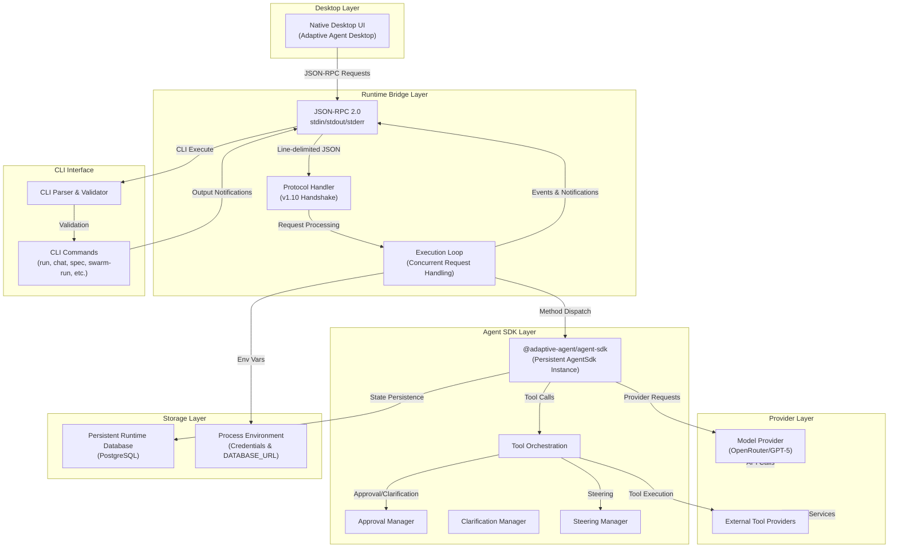
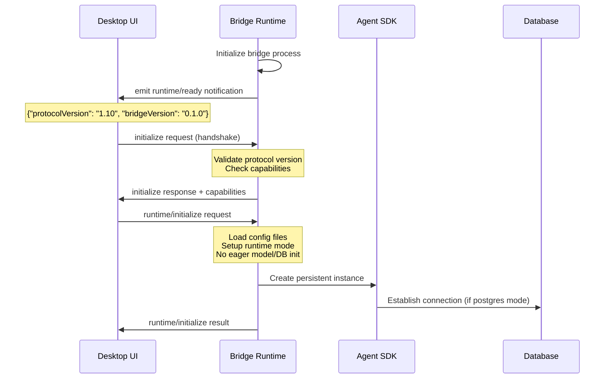
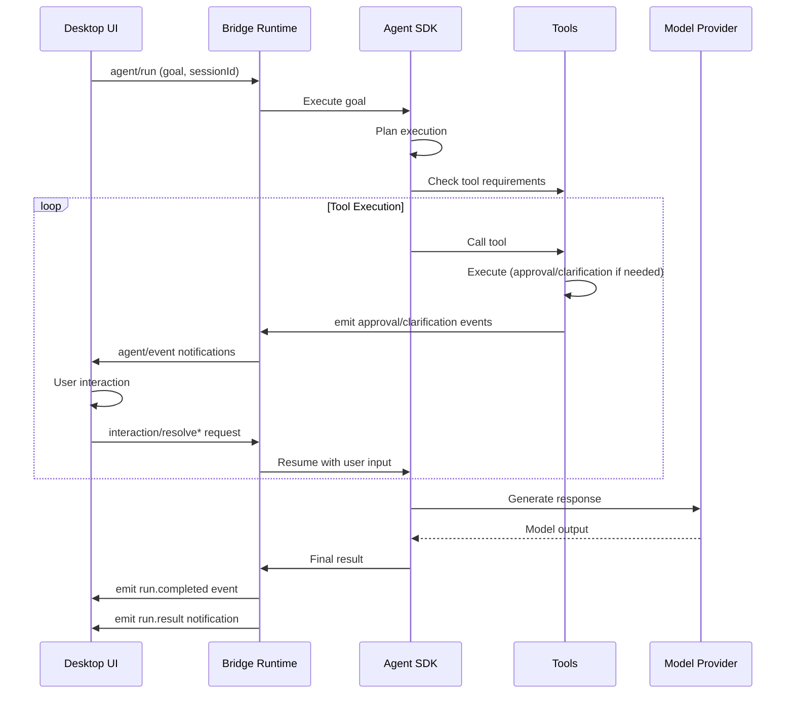

# Adaptive Agent Desktop Bridge - Architectural Report

## Executive Summary

The **Adaptive Agent Desktop Bridge** (`agent-runtime`) is a critical component that establishes a local process boundary between native desktop UI applications and the `@adaptive-agent/agent-sdk`. It manages execution loops, tool orchestration, provider interactions, user profiles, and persistent runtime access. The bridge communicates via JSON-RPC 2.0 over stdin/stdout, ensuring credentials and database configuration are sourced from the environment rather than protocol messages.

---

## System Architecture

### High-Level Architecture Diagram



---

## Component Descriptions

### 1. **Desktop Layer**
- **Native Desktop UI**: SwiftUI-based Adaptive Agent Desktop application
- Communicates exclusively through JSON-RPC 2.0
- Never handles credentials directly (inherited from environment)

### 2. **Runtime Bridge Layer**

#### Transport
- **Protocol**: JSON-RPC 2.0 over stdin/stdout
- **Line-based**: One UTF-8 JSON object per line
- **Diagnostics**: stderr reserved for runtime diagnostics
- **Current Version**: 1.10 (string to preserve semantic versioning)

#### Execution Loop
- Handles concurrent request processing
- Correlates responses via `id` field
- Processes notifications independently
- Maintains in-memory state for approvals, clarifications, and run data

#### Protocol Handler
- Manages Protocol 1.10 handshake
- Emits `runtime/ready` notification on startup
- Validates initialization parameters
- Advertises capabilities and supported methods

### 3. **Agent SDK Layer**
- **Persistent AgentSdk Instance**: Shared across all desktop workflows
- **Tool Orchestration**: Delegates tool execution and manages results
- **Approval Management**: Handles user approval workflows in manual mode
- **Clarification Management**: Manages interactive clarification interactions
- **Steering Management**: Processes user-provided steering inputs

### 4. **Provider Layer**
- **Model Provider**: OpenRouter backend (configurable model)
- **Tool Providers**: External services called through tools
- **Environment-sourced Configuration**: Credentials never transmitted in protocol

### 5. **Storage Layer**
- **PostgreSQL Database**: Persistent storage for run state, history, and metadata
- **Process Environment**: SOURCE_OF_TRUTH for credentials and DATABASE_URL
- **Runtime Mode Options**: `postgres` (persistent, cross-process) or `memory` (ephemeral)

### 6. **CLI Interface**
- **CLI Parser**: Validates arguments using canonical `parseCliArgs` implementation
- **CLI Commands**: Comprehensive coverage (run, chat, spec, swarm-run, retry, inspect, etc.)
- **Safety Guarantees**: Denies daemon operations and package modifications
- **Output Isolation**: Child stdout/stderr carried in notifications (cannot corrupt protocol stream)

---

## Protocol Flow

### Startup Sequence



### Agent Run Sequence



---

## Key Features

### 1. **Protocol 1.10 Capabilities**

| Method Category | Methods |
|---|---|
| **Initialization** | `initialize`, `runtime/initialize`, `runtime/info`, `runtime/shutdown` |
| **Agent Operations** | `agent/run`, `agent/chat` |
| **Run Control** | `run/resume`, `run/retry`, `run/recover`, `run/continue`, `run/interrupt` |
| **Run Inspection** | `run/inspect`, `run/replay`, `run/steer` |
| **Interaction** | `interaction/resolveApproval`, `interaction/resolveClarification` |
| **CLI Integration** | `cli/commands`, `cli/execute` |

### 2. **Concurrent Request Handling**
- Multiple requests can execute simultaneously
- Responses correlated by `id` field (string or number)
- No batch request support
- Event notifications processed independently

### 3. **Runtime Modes**
- **PostgreSQL**: Persistent cross-process state, shared across desktop and CLI
- **Memory**: Ephemeral state, suitable for single-session workflows

### 4. **Approval & Clarification Workflows**
- **Manual Approval Mode**: Requires user interaction for tool execution
- **Interactive Clarification Mode**: Prompts user for missing information
- In-memory state preserved across request boundaries

### 5. **CLI Command Coverage**
Comprehensive CLI surface exposed via `cli/execute`:
- **Run Operations**: run, chat, spec, swarm-run, retry, inspect, resume, recover, continue, interrupt, replay
- **Evaluation**: eval cases, eval gaia
- **Configuration**: config, catalog, init, doctor
- **Context Management**: context create, context list, context show, context delete
- **Safety Guardrails**: Denies daemon operations (ambient start, update, uninstall)

### 6. **Secure Credential Handling**
- Credentials inherited from process environment
- Never accepted or transmitted in protocol messages
- DATABASE_URL sourced from environment
- No hardcoded secrets in configuration files

---

## Error Handling

### JSON-RPC Error Codes

| Code | Meaning |
|---|----|
| `-32700` | Invalid JSON |
| `-32600` | Invalid request or unsupported batch |
| `-32601` | Unknown method |
| `-32602` | Invalid method params or CLI arguments |
| `-32603` | Unexpected internal error |
| `-32002` | Protocol or agent runtime not initialized |
| `-32003` | Protocol or agent runtime already initialized |
| `-32004` | Runtime is shutting down |
| `-32010` | CLI command rejected by runtime bridge policy |
| `-32011` | CLI command execution failed to start |

### Error Data Structure
Each error includes `error.data.protocolCode` for stable protocol-level error identification.

---

## Data Flow Examples

### Example 1: Agent Run Request
```json
{
  "jsonrpc": "2.0",
  "id": 10,
  "method": "agent/run",
  "params": {
    "goal": "Summarize this repository",
    "sessionId": "desktop-session",
    "input": { "context": "additional data" }
  }
}
```

### Example 2: Agent Event Notification
```json
{
  "jsonrpc": "2.0",
  "method": "agent/event",
  "params": {
    "schemaVersion": 1,
    "type": "run.status_changed",
    "runId": "run-123",
    "status": "running"
  }
}
```

### Example 3: CLI Execution Request
```json
{
  "jsonrpc": "2.0",
  "id": "catalog",
  "method": "cli/execute",
  "params": {
    "argv": ["catalog", "--cwd", "/workspace"]
  }
}
```

### Example 4: CLI Output Notification
```json
{
  "jsonrpc": "2.0",
  "method": "cli/output",
  "params": {
    "requestId": "catalog",
    "stream": "stdout",
    "line": "{...json output...}"
  }
}
```

---

## Design Principles

1. **Process Boundary**: Clear separation between desktop UI and agent execution
2. **Stateless Protocol**: JSON-RPC 2.0 with no custom envelopes or legacy compatibility
3. **Persistence**: Optional PostgreSQL backing for cross-process state recovery
4. **Security**: Environment-based credential management, no secret transmission
5. **Concurrency**: Non-blocking request handling with event-based notifications
6. **Extensibility**: Clear method table and capability advertisement for future versions
7. **Safety**: CLI command validation prevents dangerous operations (daemon startup, package modification)
8. **Isolation**: Child process stdout/stderr never corrupts parent protocol stream

---

## Implementation Notes

### Build & Test
```sh
bun run compile
printf '%s\n' \
  '{"jsonrpc":"2.0","id":1,"method":"initialize","params":{"protocolVersion":"1.10","clientInfo":{"name":"smoke"}}}' \
  '{"jsonrpc":"2.0","id":2,"method":"cli/execute","params":{"argv":["--version"]}}' \
  | dist/agent-runtime
```

### Version Semantics
- Protocol version `1.10` is intentionally a **string** (not numeric `1.1`)
- Ensures semantic versioning accuracy (1.10 ≠ 1.1 numerically)

### CLI Execution Characteristics
- Child spawned directly without shell
- Cannot override environment variables
- Defaults to `--output json` when no format specified
- Maximum timeout: 24 hours

---

## Conclusion

The Adaptive Agent Desktop Bridge establishes a robust, secure, and extensible communication protocol between native desktop applications and the Adaptive Agent SDK. Through careful separation of concerns, concurrent request handling, persistent state management, and comprehensive error handling, it provides a production-grade foundation for building desktop-based AI agent workflows.

The Protocol 1.10 specification ensures forward compatibility while maintaining strict security boundaries around credential management and system operations. The bridge's dual support for both typed methods (persistent workflows) and CLI execution (standalone operations) provides flexibility for diverse use cases, from interactive desktop workflows to batch processing and scripting.
